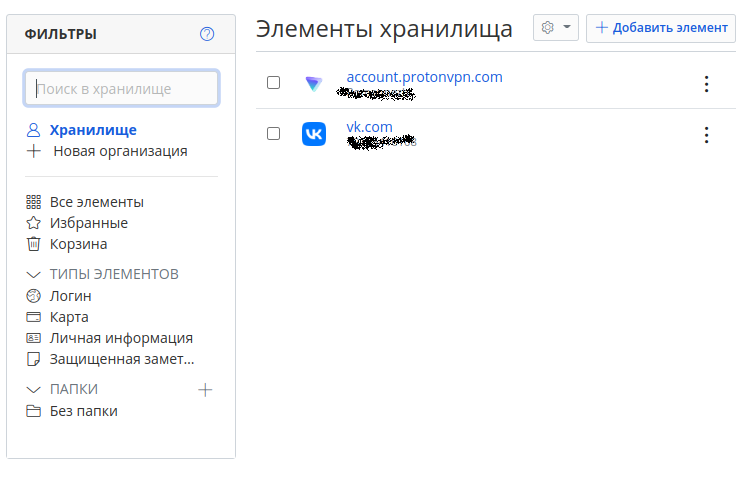
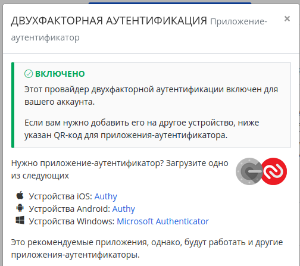

1. Установите Bitwarden плагин для браузера. Зарегестрируйтесь и сохраните несколько паролей.

**Ответ:**

Установил `Bitwarden`, сохранил пару паролей.



2. Установите Google authenticator на мобильный телефон. Настройте вход в Bitwarden акаунт через Google authenticator OTP.

**Ответ:**



3. Установите apache2, сгенерируйте самоподписанный сертификат, настройте тестовый сайт для работы по HTTPS.

**Ответ:**

### * Установил `apache2`:
```
sudo apt install apache2
```
### * Сгенерировал сертификат:
```
vagrant@sysadm-fs:~$ openssl req -x509 -nodes -days 365 -newkey rsa:2048 -keyout /etc/ssl/private/ssl-cert-snakeoil.key -out /etc/ssl/certs/ssl-cert-snakeoil.pem -subj "/C=RU/ST=Tyumen/L=NV/O=Netolgy/OU=devops/CN=localhost"
```
### * Настроил и проверил сайт:
```
vagrant@sysadm-fs:~$ sudo vim /etc/apache2/sites-available/www.example.com.conf

vagrant@sysadm-fs:~$ sudo mkdir /var/www/example.com

vagrant@sysadm-fs:~$ sudo a2ensite www.example.com
```
4. Проверьте на TLS уязвимости произвольный сайт в интернете (кроме сайтов МВД, ФСБ, МинОбр, НацБанк, РосКосмос, РосАтом, РосНАНО и любых госкомпаний, объектов КИИ, ВПК ... и тому подобное).

**Ответ:**
```
vagrant@sysadm-fs:~/testssl.sh$ ./testssl.sh -U --sneaky https://donstu.ru

###########################################################
    testssl.sh       3.2rc2 from https://testssl.sh/dev/
    (198bb09 2022-11-28 17:09:04)

      This program is free software. Distribution and
             modification under GPLv2 permitted.
      USAGE w/o ANY WARRANTY. USE IT AT YOUR OWN RISK!

       Please file bugs @ https://testssl.sh/bugs/

###########################################################

 Using "OpenSSL 1.0.2-bad (1.0.2k-dev)" [~179 ciphers]
 on nezhivovraPC:./bin/openssl.Linux.x86_64
 (built: "Sep  1 14:03:44 2022", platform: "linux-x86_64")


 Start 2022-12-14 21:35:38        -->> 83.234.174.17:443 (donstu.ru) <<--

 rDNS (83.234.174.17):   www.donstu.ru.
 Service detected:       HTTP


 Testing vulnerabilities 

 Heartbleed (CVE-2014-0160)                not vulnerable (OK), no heartbeat extension
 CCS (CVE-2014-0224)                       not vulnerable (OK)
 Ticketbleed (CVE-2016-9244), experiment.  not vulnerable (OK)
 ROBOT                                     Server does not support any cipher suites that use RSA key transport
 Secure Renegotiation (RFC 5746)           supported (OK)
 Secure Client-Initiated Renegotiation     not vulnerable (OK)
 CRIME, TLS (CVE-2012-4929)                not vulnerable (OK)
 BREACH (CVE-2013-3587)                    no gzip/deflate/compress/br HTTP compression (OK)  - only supplied "/" tested
 POODLE, SSL (CVE-2014-3566)               not vulnerable (OK)
 TLS_FALLBACK_SCSV (RFC 7507)              No fallback possible (OK), no protocol below TLS 1.2 offered
 SWEET32 (CVE-2016-2183, CVE-2016-6329)    not vulnerable (OK)
 FREAK (CVE-2015-0204)                     not vulnerable (OK)
 DROWN (CVE-2016-0800, CVE-2016-0703)      not vulnerable on this host and port (OK)
                                           make sure you don't use this certificate elsewhere with SSLv2 enabled services, see
                                           https://search.censys.io/search?resource=hosts&virtual_hosts=INCLUDE&q=7E5AB217F1736B6E9078E2C5E75DB4F803400EB34DAA970EEB2DB185B9B86544
 LOGJAM (CVE-2015-4000), experimental      not vulnerable (OK): no DH EXPORT ciphers, no DH key detected with <= TLS 1.2
 BEAST (CVE-2011-3389)                     not vulnerable (OK), no SSL3 or TLS1
 LUCKY13 (CVE-2013-0169), experimental     potentially VULNERABLE, uses cipher block chaining (CBC) ciphers with TLS. Check patches
 Winshock (CVE-2014-6321), experimental    not vulnerable (OK)
 RC4 (CVE-2013-2566, CVE-2015-2808)        no RC4 ciphers detected (OK)


 Done 2022-12-14 21:36:35 [  62s] -->> 83.234.174.17:443 (donstu.ru) <<--

```

5. Установите на Ubuntu ssh сервер, сгенерируйте новый приватный ключ. Скопируйте свой публичный ключ на другой сервер. Подключитесь к серверу по SSH-ключу.

**Ответ:**

### * Сгенерировал ключ:
```
vagrant@sysadm-fs:~$ ssh-keygen
Generating public/private rsa key pair.
Enter file in which to save the key (/home/vagrant/.ssh/id_rsa): 
/home/vagrant/.ssh/id_rsa already exists.
Overwrite (y/n)? y
Enter passphrase (empty for no passphrase): 
Enter same passphrase again: 
Your identification has been saved in /home/vagrant/.ssh/id_rsa
Your public key has been saved in /home/vagrant/.ssh/id_rsa.pub
The key fingerprint is:
SHA256:QtaOdkgWApNDRbHCymLAn3ae2wuu/99nzxFFQbDmKGo vagrant@sysadm-fs
The key's randomart image is:
+---[RSA 3072]----+
| .+==..      .ooo|
|..o. o o      .. |
|..o.. = .    o  .|
|o....= +    +   .|
|oo + .= S. . . . |
|o . o..o. .     .|
|     + E       . |
|    . =   .  o. .|
|   .o+.+o. .o .o |
+----[SHA256]-----+
```
### * Скопировал публичный ключ на удаленный сервер и подключился:
```
/usr/bin/ssh-copy-id: INFO: Source of key(s) to be installed: "new1.pub"
/usr/bin/ssh-copy-id: INFO: attempting to log in with the new key(s), to filter out any that are already installed
/usr/bin/ssh-copy-id: INFO: 1 key(s) remain to be installed -- if you are prompted now it is to install the new keys
nezhivovra@213.87.103.125's password: 

Number of key(s) added: 1

Now try logging into the machine, with:   "ssh 'nezhivovra@213.87.103.125'"
and check to make sure that only the key(s) you wanted were added.

vagrant@sysadm-fs:~$ ssh nezhivovra@213.87.103.125
nezhivovra@213.87.103.125's password: 
Activate the web console with: systemctl enable --now cockpit.socket
```
6. Переименуйте файлы ключей из задания 5. Настройте файл конфигурации SSH клиента, так чтобы вход на удаленный сервер осуществлялся по имени сервера.

**Ответ:**
### * Переименовал файлы ключей из задания 5:
```
vagrant@sysadm-fs:~$ mkdir -p ~/.ssh && chmod 700 ~/.ssh
vagrant@sysadm-fs:~$ touch ~/.ssh/config && chmod 600 ~/.ssh/config
```
### * Создал и отредактировал файл конфигурации:
```
vagrant@sysadm-fs:~$ mkdir -p ~/.ssh && chmod 700 ~/.ssh
vagrant@sysadm-fs:~$ touch ~/.ssh/config && chmod 600 ~/.ssh/config
```
```
Host server1  
HostName 213.87.103.125
IdentityFile ~/.ssh/new2.key
User Nezhivovra
Host *
        User Nezhivovra
        IdentityFile ~/.ssh/new2.pub
        Protocol 2
```
Теперь идет подключение на удаленный сервер по имени сервера:
```
vagrant@sysadm-fs:~$ ssh server1
Enter passphrase for key '/home/vagrant/.ssh/new2.key': 
Activate the web console with: systemctl enable --now cockpit.socket
```
7. Соберите дамп трафика утилитой tcpdump в формате pcap, 100 пакетов. Откройте файл pcap в Wireshark.

**Ответ:**
```
vagrant@sysadm-fs:~$ tcpdump -c 100 -w dump.pcap 
tcpdump: listening on enp3s0, link-type EN10MB (Ethernet), snapshot length 262144 bytes
100 packets captured
124 packets received by filter
0 packets dropped by kernel
```
